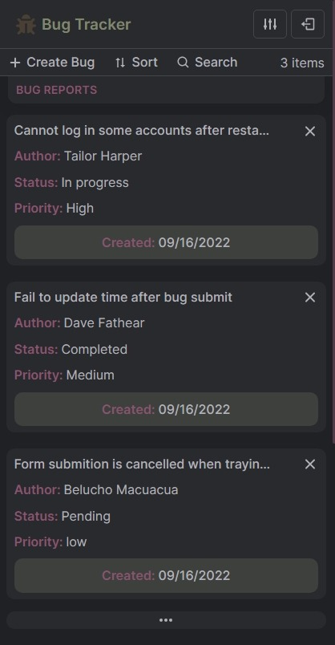
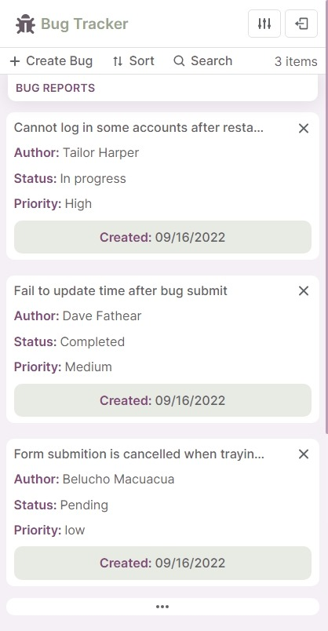

# Bug Tracker Application (React + Typescript)

This repository contains a **bug tracker application** built with React.JS and Typescript. To be short, the main goal here is to help developers to keep track of the software development bugs and issues, in a simple and more efficient way. You can find the API source code [here](https://github.com/KainNhantumbo/bug-tracker-api).

**Access this app live at: [https://bug-tracker-pied.vercel.app](https://bug-tracker-pied.vercel.app)**

**Here are some screenshots in default light and dark themes:**




## Version 1.2.0

- Implemented user authentication using tokens and refresh tokens strategy with secure httpOnly cookies.
- Improved application layout to be responsive on mobile devices.
- Improved performance in state management, stability and fixed some bugs.

## Version 1.0.0 released!

Finally, I just released the first stable version of the app. Has the development goes further I will be listing the introduced and new application features. For now, they are:

- This application is able to perform all CRUD operations to manipulate data to accomplish its purposes.

- Built from scratch, a custom, beautiful and clean user interface, all built powered with styled-components, and ofcourse, animations.

- Has more than just default dark and light themes, for now, there are 4 themes to choose, between light and dark themes. Uses the browser localStorage to save user theme preferences.

## Scripts for testing

Make sure you have installed **Node.js (v16.15.1 or later recommended) and also comes with npm**.\
In the project directory, you can run in terminal:

```bash
 npm run dev
```

Runs the app in the development mode.\
Open [http://localhost:3000](http://localhost:3000) to view it in your browser.

The page will reload when you make changes.\
You may also see any lint errors in the console.

```bash
npm run build
```

Builds the app for production to the **build folder**.\
It correctly bundles React in production mode and optimizes the build for the best performance.

## Contact

E-mail: [nhantumbok@gmail.com](nhantumbok@gmail.com 'Send an e-mail')\
Github: [https://github.com/KainNhantumbo](https://github.com/KainNhantumbo 'See my github profile')  
Portfolio: [https://portifolio-dev-mu.vercel.app](https://portifolio-dev-mu.vercel.app 'See my portfolio website')\
My blog: [https://publish-it-programming.vercel.app](https://publish-it-programming.vercel.app 'Visit my website')

#### If you like this project, let me know by leaving a star on this repository so I can keep improving this app.😊😘

Best regards, see ya at work.\
**Made with ❤ React and Typescript**

## License

Licensed under Apache 2.0 License. All rights reserved.\
Copyright &copy; 2022 Kain Nhantumbo.

Licensed under the Apache License, Version 2.0 (the "License"); you may not use this file except in compliance with the License. You may obtain a copy of the License at http://www.apache.org/licenses/LICENSE-2.0

Unless required by applicable law or agreed to in writing, software distributed under the License is distributed on an "AS IS" BASIS, WITHOUT WARRANTIES OR CONDITIONS OF ANY KIND, either express or implied. See the License for the specific language governing permissions and limitations under the License.
